# cod.m Eagle Libraries
This is a loose collection [cod.m GmbH](https://www.codm.de/)'s self-made eagle libraries, licensed under GPL.

## E18-MS1-IPX and E18-MS1-PCB
Eagle footprints including 3D models for the CC2530 based EByte E18-MS1-IPX and E18-MS1-PCB modules.

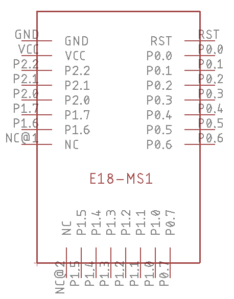

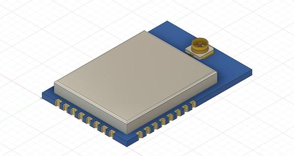
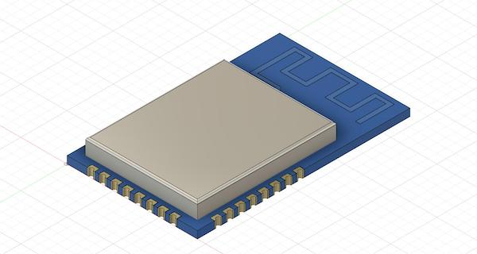

## E18-MS1PA1-IPX
Eagle footprint including the 3D model for the CC2530+CC2592 EByte E18-MS1PA1-IPX module.

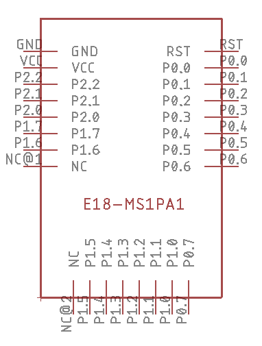
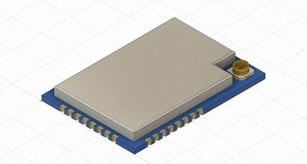

## E18-MS1PA2

### E18-MS1PA2-PCB

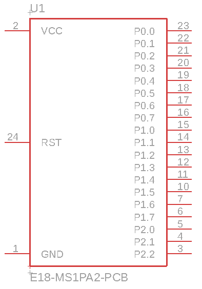

## E07-868MS10
Should also be applicable for the E07-433MS10. These modules seem to be EOL, refer to the E07-xxxM10S modules.

## E07-900M10S
Eagle footprint including 3d model for ebyte's "new" E07-900M10S CC1101 PCB, which should be the succesor of the E07-8686MS10

3D model on GrabCad: https://grabcad.com/library/rf-star-cc2652p-module-1

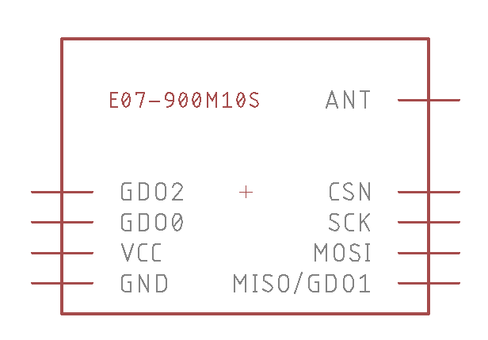
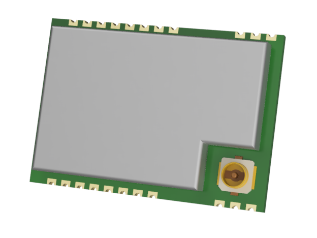

## CC2538 module
Eagle footprint for the common chinese CC2538+CC2592 module. Thanks to [@uzsito](https://github.com/uzsito/CC2538-CC2592-kicad-component) for the 3D model, used from his KiCad library.

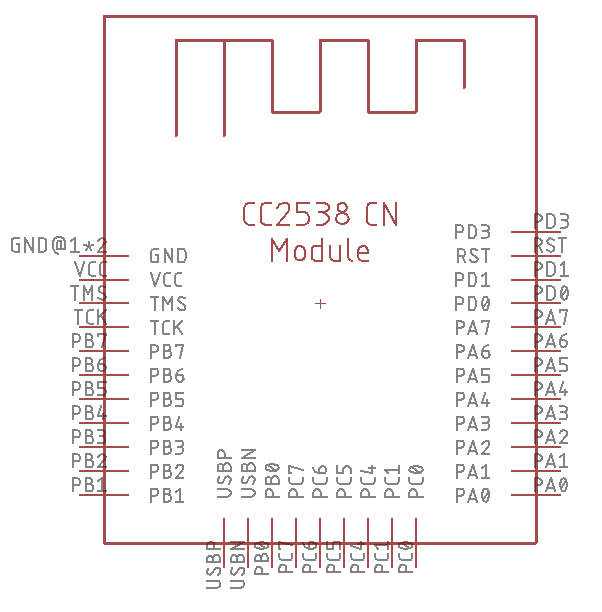

## CC2652P2 module (RF-Star)
Eagle footprint for the well known CC2652P2  module (RF-Star) from (e.g.) Duoweisi. 

3D model can also be found on GrabCad: https://grabcad.com/library/rf-star-cc2652p-module-1

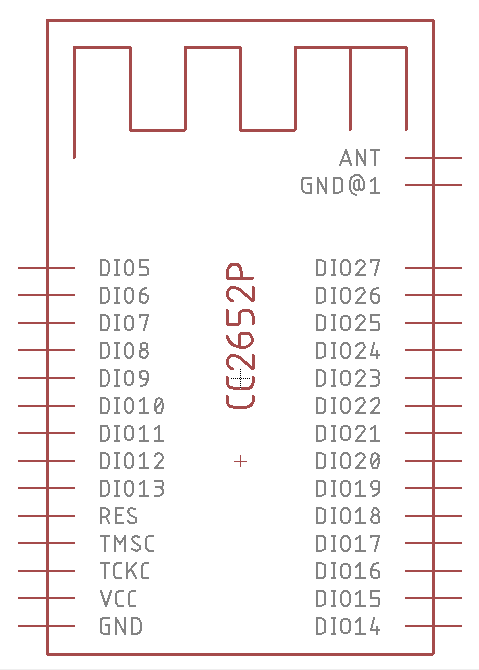
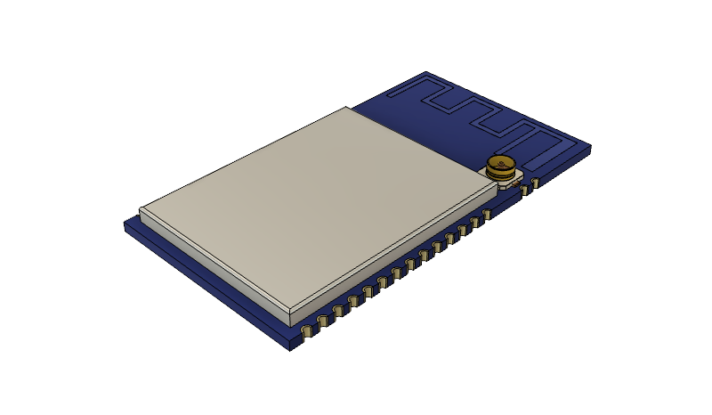

# Contributing

1. Fork it!
2. Create your feature branch: `git checkout -b my-new-feature`
3. Commit your changes: `git commit -am 'Add some feature'`
4. Push to the branch: `git push origin my-new-feature`
5. Submit a pull request :D

# Credits
* [Patrik Mayer](https://allgeek.de), [cod.m GmbH](https://www.codm.de)
* [Mark Molnar](https://github.com/uzsito), 3D Model CC2538
* [Simon Christmann](https://github.com/dersimn)

# License
GPL-3.0
